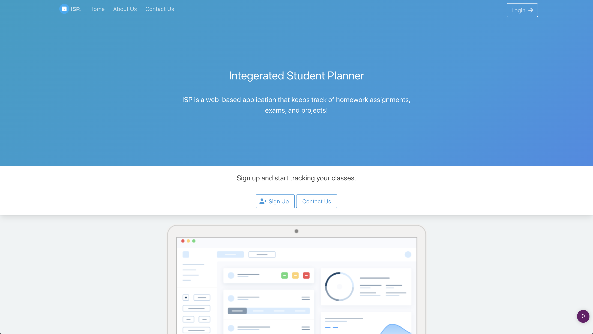
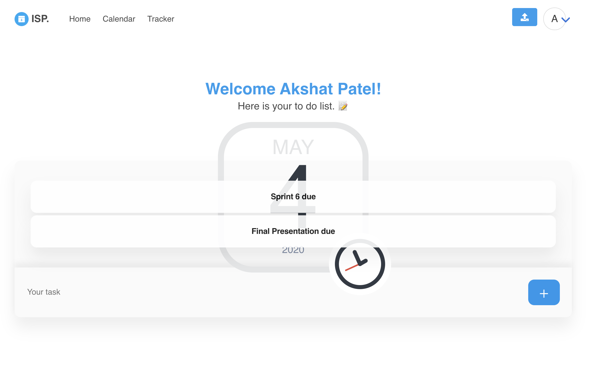
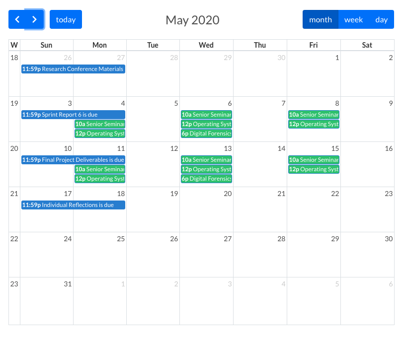

# Welcome to Integrated Student Planner (ISP) 👋


> ISP is a web-based application that keeps track of homework assignments, exams, and projects and notifies you via email and chrome notifications before they are due. The key feature of ISP is the ability to automate calendars and information from external sources easily into our application.

### 🏠 [Homepage](http://34.74.137.73:5000/) 
 

### ✨ [Demo](http://34.74.137.73:5000/)
 
 

## Usage

```sh
1. Run pip install -r requirements.txt (Python 2), 
or pip3 install -r requirements.txt (Python 3)
2. Read *dbconfigReadme.txt* to configure database.
3. Run *flaskSettings* shell script to run the app. 

```

## Author

👤 **Akshat Patel and David Ijagbemi**

